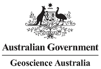

# FSDF Vocabularies
This repository contins vocabularies owned and/or managed by the [Intergovernmental Committee on Surveying and Mapping](https://www.icsm.gov.au/) as part of the Foundational Spatial Data Framework (FSDF) initiative.

These _vocabularies_ are controlled lists of terms formulated according to the [Simple Knowlege Organization System (SKOS)](https://www.w3.org/TR/skos-reference/) taxonomy data model.

All the vocabularies in the [vocabularies/](vocabularies/) folder of the `main` branch of this repository are automatically loaded into the FSDF vocabulary publication system which can be seen online at:

* **<https://linked.fsdf.org.au/vocprez>**

## License & Copyright
The vocabularies in this repository are licensed using the [CC BY 4.0](https://creativecommons.org/licenses/by/4.0/) licence. See the [LICENSE file](LICENSE) for the deed. 

Other vocabularies reproduced by ICSM may have other licensing arrangements. See the individual vocabulary files for details.

All vocabularies published by ICSM: &copy; Commonwealth of Australia (Geoscience Australia), 2022.

## Contact
**FSDF Office**  
*Geoscience Australia*  
GPO Box 378, Canberra ACT 2601 Australia  
Cnr Jerrabomberra Ave and Hindmarsh Drive, Symonston ACT 2609  
<fsdf@ga.gov.au>
